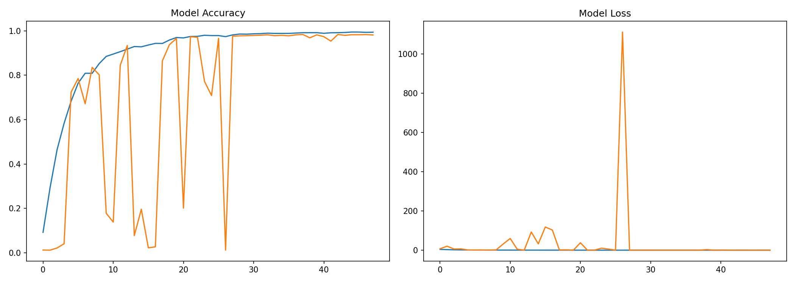
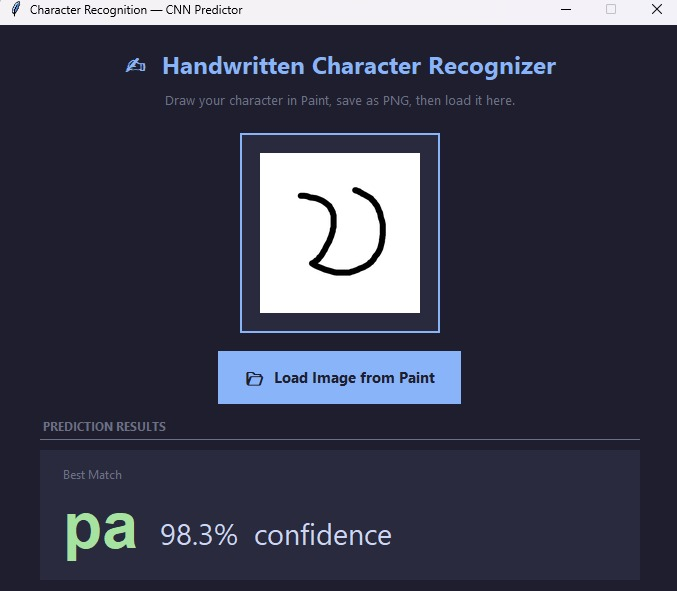

# Handwritten Saurashtra Character Recognition System

## Overview

This project implements an end-to-end handwritten character recognition system for the **Saurashtra script** using a Convolutional Neural Network (CNN).

Unlike basic classification projects, this system covers the complete pipeline:

* Dataset creation from handwritten pages
* Data preprocessing and augmentation
* Model training and evaluation
* Real-time prediction using a GUI interface

---

## Language Focus: Saurashtra

This project is designed specifically for the **Saurashtra script**, a low-resource language with limited digital datasets.

Challenges addressed:

* No publicly available labeled dataset
* No pre-trained models for this script
* Requirement to build dataset manually

To solve this, a complete pipeline was developed:

1. Manual character extraction from handwritten pages
2. Structured dataset creation
3. Controlled data augmentation
4. Model training from scratch

---

## Project Structure

```bash
.
├── dataset/                 # Dataset (not included)
├── preprocessing/
│   ├── slice_characters.py
│   ├── augment_dataset.py
│
├── train_model.py
├── predict.py
├── label_map.json
├── training_history.png
├── requirements.txt
├── .gitignore
```

---

## Step 1 — Dataset Creation (Slicing)

A custom script is used to extract characters from handwritten pages.

### Process

* Load handwritten image
* Click on a character
* Extract region around click
* Resize to 128×128 pixels
* Assign label manually
* Save to class-specific folder

### Output format

```
dataset/<class_name>/<index>.png
```

### Usage

```bash
python preprocessing/slice_characters.py
```

---

## Step 2 — Data Augmentation

To improve generalization, synthetic variations are generated.

### Techniques used

* Rotation (±15°)
* Translation (shift)
* Gaussian blur
* Noise injection

### Design approach

Instead of generating excessive data, augmentation is controlled:

```python
TOTAL_AUGMENTS_PER_FOLDER = 100
```

### Key behavior

* Only original numeric images are used as base
* Augmented images are saved with new indices
* Numerical classes (0–9) start from index 22
* Other classes continue from last index

### Usage

```bash
python preprocessing/augment_dataset.py
```

---

## Step 3 — Model Training

A CNN model is trained for multi-class classification.

### Model details

* Input size: 128×128 (grayscale)
* Convolution layers + Batch Normalization
* MaxPooling and Dropout
* Fully connected layers with softmax output

### Training pipeline

* Load dataset from folder structure
* Normalize pixel values
* Encode labels
* Train / validation / test split
* Train using:

  * EarlyStopping
  * ReduceLROnPlateau
  * ModelCheckpoint

### Usage

```bash
python train_model.py
```

### Output files

* `character_model.h5`
* `label_map.json`
* `training_history.png`

---

## Step 4 — Prediction Interface

A GUI application allows real-time prediction of handwritten characters.

### Features

* Draw or load handwritten image
* Automatic preprocessing (resize, grayscale, normalization)
* Top predictions with confidence scores

### Usage

```bash
python predict.py
```

---

## Training Performance



### Results

* Training accuracy: ~99%
* Validation accuracy: ~97–98%

### Observations

* Validation accuracy fluctuates in early epochs due to dataset variability
* Final accuracy stabilizes after training convergence

### Note on Loss

Validation loss may show spikes during early training due to:

* High number of classes (~85)
* Limited samples per class
* Augmentation variability

Despite this, the model converges and performs reliably.

---

## Step 5 — Testing with Paint

### Setup

1. Open Microsoft Paint
2. Set canvas size to 400×400
3. Use black brush on white background

### Drawing guidelines

* Draw large and centered
* Use thick strokes
* Keep background clean

### Prediction

1. Save image as PNG
2. Run:

```bash
python predict.py
```

3. Load the image and view predictions

---


## Installation

```bash
pip install -r requirements.txt
```

---

## Requirements

* tensorflow
* numpy
* opencv-python
* pillow
* matplotlib
* scikit-learn

---

## Limitations

* Dataset not included due to size but you can make your own dataset using slice_characters.py and augment_dataset.py.
* Performance depends on handwriting quality
* Manual dataset creation is time-intensive

---

## Future Improvements

* Automatic character segmentation
* Improved preprocessing for handwritten input
* Model optimization for better accuracy
* Web or mobile deployment

---

## Summary

This project demonstrates a complete machine learning pipeline for a low-resource language, including:

* Dataset creation from scratch
* Data augmentation strategy
* CNN-based training and evaluation
* Real-time handwritten character recognition

It highlights practical challenges and solutions when working without existing datasets.
